# Как работать через GITHUB?

## Ветки

### Какие у нас ветки?

#### main (master)

Системная ветка, в ней будет только стабильный код, то есть, готовый для билда. Более того, прямые коммиты в эту ветку запрещены. Остальным участникам про эту ветку, по сути, можно забыть, так как слияние других веток в main будет осуществлять тимлид.

#### develop

Наша основная ветка, тут будет самый свежий код, но он может работать нестабильно. Прямые коммиты в эту ветку нежелательны, лучше создавать отдельную ветку и потом делать pull-request в develop. При создании новой ветки, следует выбрать какой-то из предложенных типов:

- [fix/](#fix/)
- [feature/](#feature/)
- [Остальные ветки](#Остальные-ветки)

#### fix/

Ветки, с названиями по формату `fix/название-ветки`. Их целью будет исправить какую-то ошибку, баг или несовместимость, иными словами, они не добавляют нового функционала, а исправляют старый. Соответственно, вместо `название-ветки` стоит указать исправляемую ошибку (на английском, например, `fix/stuck-in-wall`). Когда ошибка была исправлена, следует сделать pull-request в [develop](#develop).

#### feature/

Ветки, с названиями по формату `feature/название-ветки`. Их целью является добавление нового функционала: новое главное меню, новая механика, какой-нибудь визуальный эффект и тому подобное. Вместо `название-ветки` следует указать добавляемую механику (на английском, например, `feature/parriable-bullets`). После реализации поставленной задачи следует сделать pull-request в [develop](#develop).

#### Остальные ветки

Такие случаи будут крайне редкими, но, иногда надо будет внести какие-то изменения, которые не касаются ни исправления багов, ни добавления нового функционала. В таком случае название ветки стоит создавать в формате `название-ветки` (на английском, например, `update-design-document`). Соответственно, после осуществления поставленной задачи следует сделать pull-request в [develop](#develop).

### Как переключить ветку?

Чтобы переключиться на нужную ветку, в приложении `GitHub Desktop` надо нажать по текущей ветке (`Current branch`):

После чего из списка веток выбрать нужную:

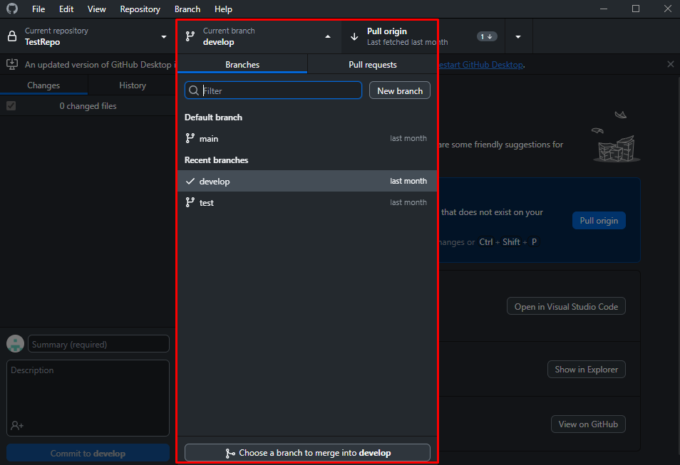

Когда нужная ветка была выбрана, то её название появится под `Current branch` сверху (см. первый скрин). Соответсвенно, все коммиты будут создаваться именно в этой ветке.

### Как создать ветку?

В большинстве случаев я (тимлид) буду самостоятельно создавать вам нужные ветки, так что вам нужно будет просто [переключиться на них](#Как-переключить-ветку?). Если такого не произошло или вы решили проявить инициативу и протестить что-то самостоятельно, то тогда можете самостоятельно сделать новую ветку.

Для начала, нужно открыть список веток, кликнув по `Current branch`:

После этого необходимо нажать `new branch`:

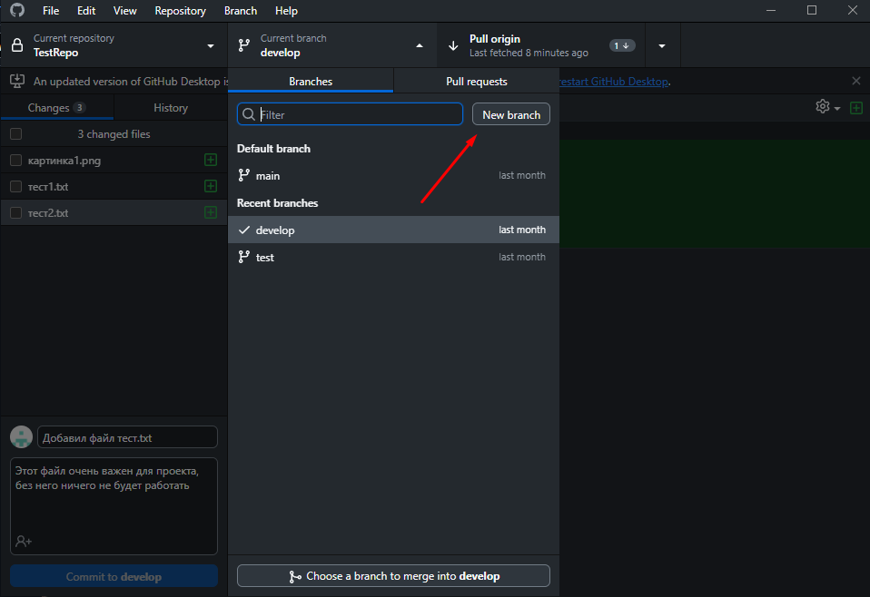

И в новом окне указать название ветки (1) и выбрать ветку `develop` (2) как основную, поскольку именно в ней самый свежий код. В конце нужно нажать `Create branch`. Если возникли вопросы по тому, как составить название ветки, то посмотрите раздел ["Какие у нас ветки?"](#Какие-у-нас-ветки?), там в описаниях типов веток есть указания по их названиям.

## Коммиты

### Суть коммитов

Каждый коммит является небольшим сохранением новых изменений. Коммиты должны быть небольшими и решать какую-то небольшую цель. Иными словами, коммиты надо делать такими, чтобы в будущем ошибочные изменения можно было отменить, не задев при этом полезные изменения. 

Например, добавление спрайта персонажа, исправление бага в атаке и добавление нового уровня в одном коммите – очень плохое решение. Более того, в самом изложении этого "коммита" он делится на 3 логические части, то есть, спрайт, баг-фикс и новый уровень нужно зафиксировать по отдельным коммитам.

### Как выбрать файлы и строки для коммита?

Если вы своевременно делаете коммиты по мере работы, то эта инструкция, в большинстве случаев, вам не пригодиться. Но если вы сразу сделали несколько разных изменений и теперь хотите разделить их по разным коммитам, то читайте далее.

Во-первых, все новые или изменённые файлы отображаются в левом списке. Более того, все эти изменения выбраны по-умолчанию:

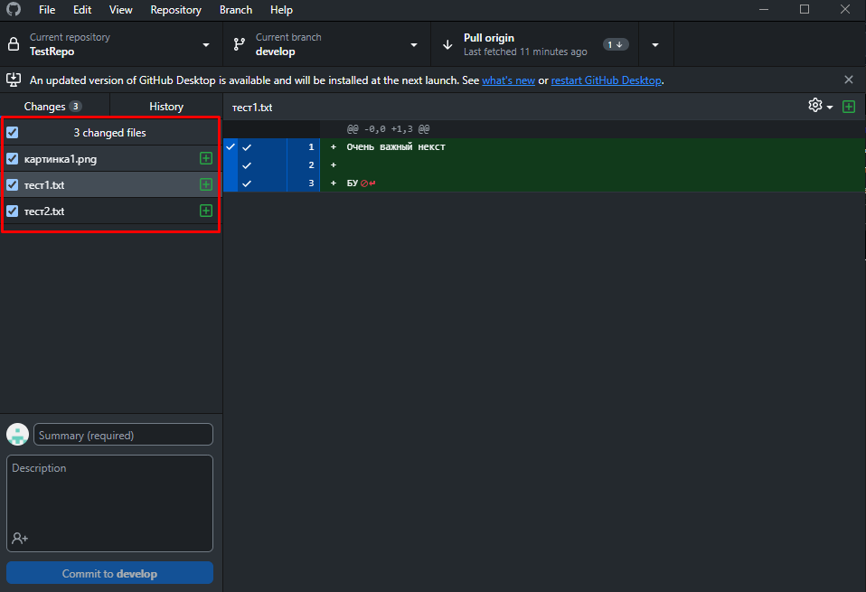

Нажимая на чек-боксы слева от названий файлов (верхняя картинка), можно убрать или добавить файлы в предстоящий коммит.

Помимо выбора файлов, можно выбрать ещё сами строки внутри файлов. Для этого нужно кликнуть по нужному файлу и воспользоваться центральной частью приложения:

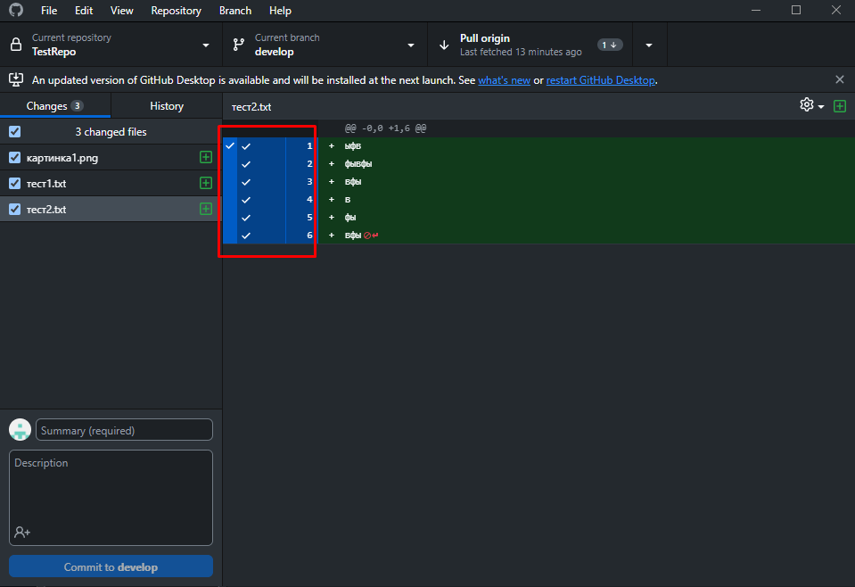

Например, представим, что файл1 и файл2 носят какое-то исправление бага, при этом в файле1 ещё есть дополнительное исправление, которое к этому багу не имеет отношение. Более того, ещё есть картинка, которая вообще с багами никак не связана, так что для нового коммита нужно убрать картинку и ненужную строку в файле, что будет выглядеть следующим образом:

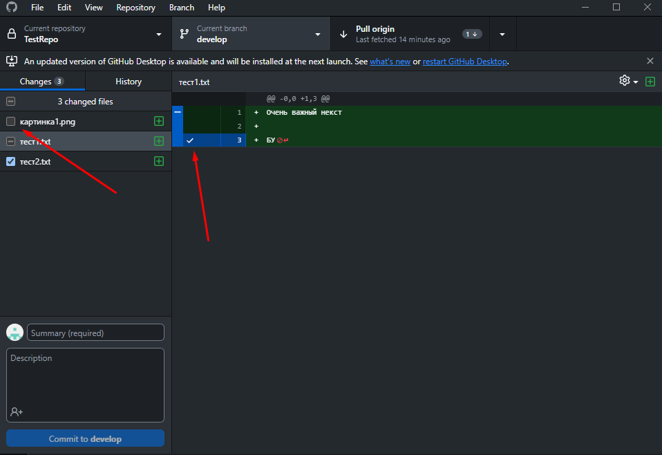

### Как создать коммит?

После [выбора нужных файлов](#Как-выбрать-файлы-и-строки-для-коммита?), можно приступить к созданию самого коммита. Самое главное – это указать название коммита (1) на русском языке, без заголовка создание коммита невозможно. Название коммита должно быть кратким: в среднем случае 3-4 слова, редко достигает 5 слов, к тому же само приложение высветит предупреждение, если длина названия превысит 50 символов. Также название коммита должно быть ответом на вопрос "Что я сделал?" и начинаться с глагола в прошедшем времени.

Если суть коммита не получается уложить в названии, то заголовок можно сделать сосвсем обобщённым, например "добавил картинку", после чего в описании (2) указать подробности, что это за картинка. Описание не обязательно и для сосвсем мелких коммитов, обычно, не имеет смысла.

После указания названия и описания (если нужно), следует нажать кнопку `Commit to ...` (3), чтобы добавить коммит в выбранную ветку. Выбор нужной ветки смотри [тут](#Как-переключить-ветку?).

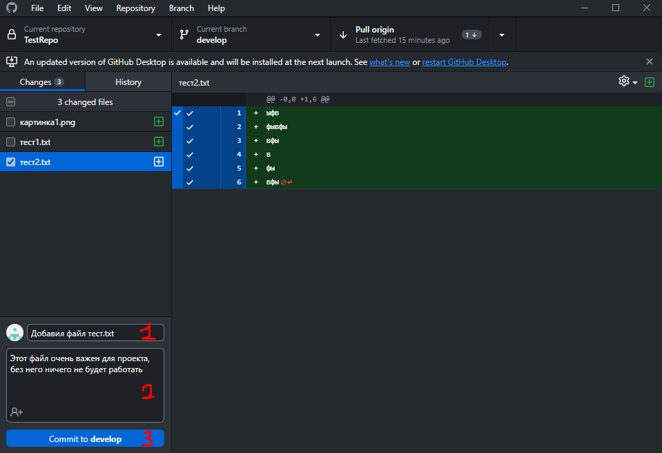

## Pull-Request (PR)

### В чем суть?

В нашем проекте pull-request (далее PR) выступает в роли запроса на слияние изменений в [develop](#develop) и в роли запроса на проверку этих самых изменений. Другими словами, если вы решили какую-то поставленную задачу, то можете делать PR, чтобы я (тимлид) проверил ваш код. При этом PR можно делать даже если у вас соменения в качестве кода, главное – чтобы он выполнял поставленные задачи, а советы по улучшению я напишу как раз в вашем PR.

### Как создать PR?

Для этого нужно перейти на сайт GitHub'а в наш [репозиторий](https://github.com/Dkoplik/Paint-it-Black), после чего выбрать вкладку `Pull requests`:

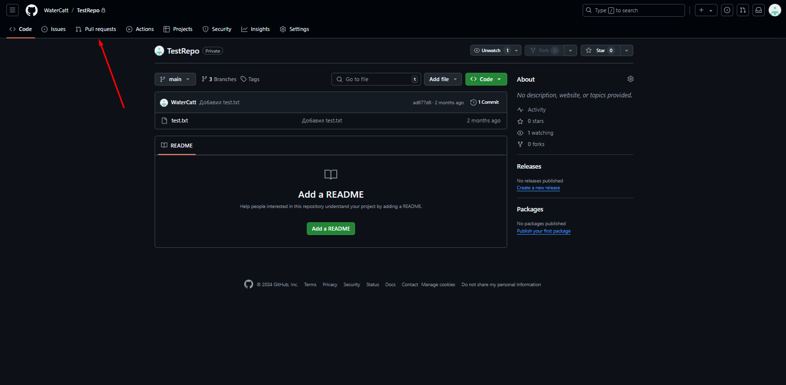

После этого нажать `New pull request`:

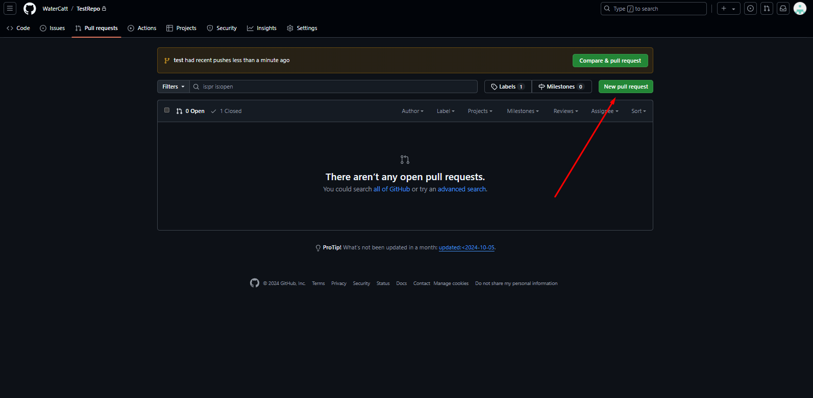

Затем надо выбрать ветку, в которую предлагает слить ваши изменения (1), этой веткой всегда будет [develop](#develop). Далее выбираете вашу ветку (2), из которой предлагаете взять изменения. После этого продолжаете создание PR (3):

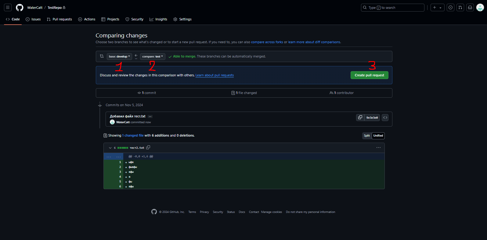

Далее надо задать название (1) ваше PR. Название лучше делать коротким, оно должно отвечать на вопрос "Что я сделал?" и начинаться с глагола. Остальные подробности вашей проделанной работы пишите в описании (2). В конце надо назначить меня (Коплик Дмитрий) проверяющим (3) и нажать кнопку `Create pull request`. Всё, ваш PR создан.

Обращаю внимание, что после создания PR нажимать `Merge pull request` **НЕ НАДО**, принимать и закрывать ваш PR буду я (тимлид).

### Как посмотреть замечания к PR?

Для этого на сайте нашего [репозитория](https://github.com/Dkoplik/Paint-it-Black) надо зайти в раздел `Pull request` и выбрать из списка свой PR:

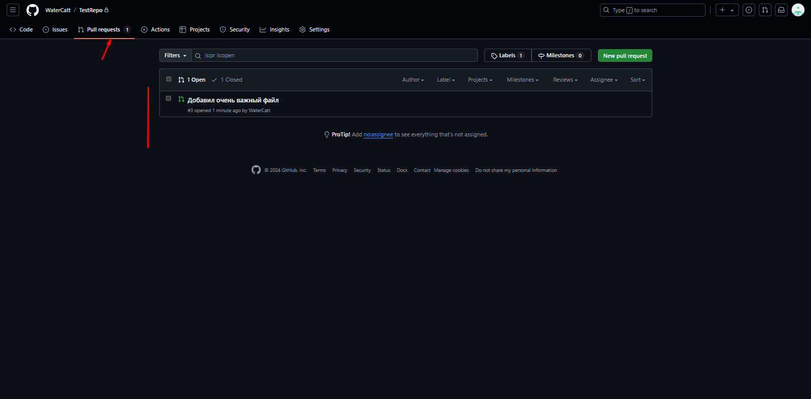

Все мои замечания будут отображены в комментариях к вашему PR:

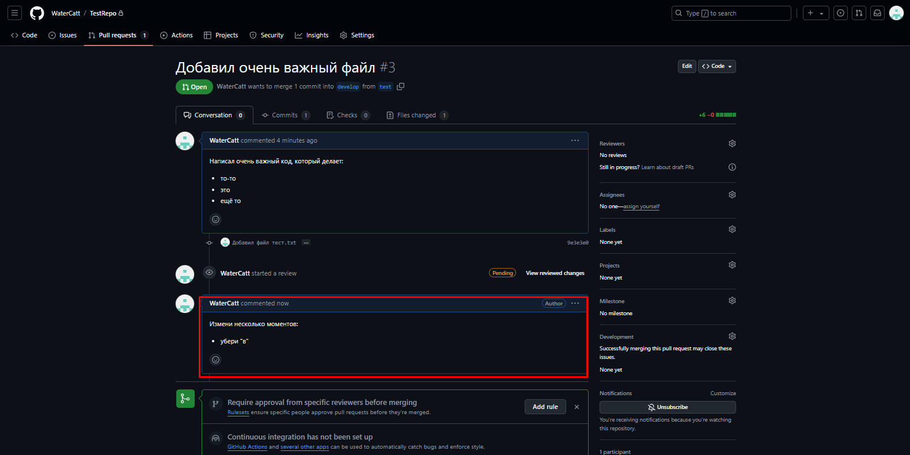

Однако примечания к самому коду в таком виде может быть неудобно, поэтому, скорее всего, будет лучше перейти в `Files changed`:

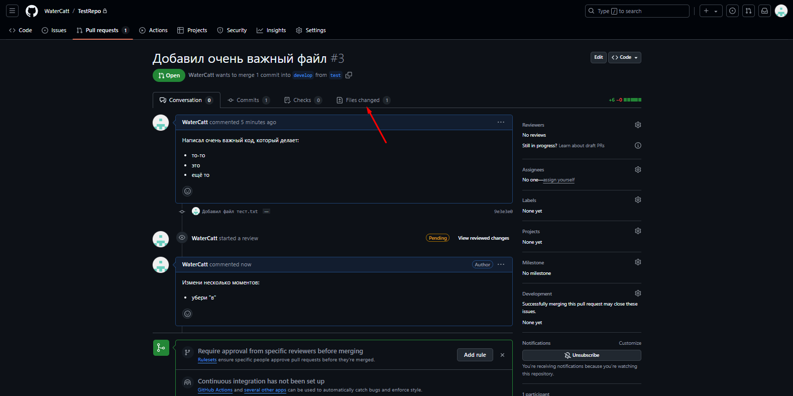

После чего вы сможете увидеть свой код и мои комментарии в нём:

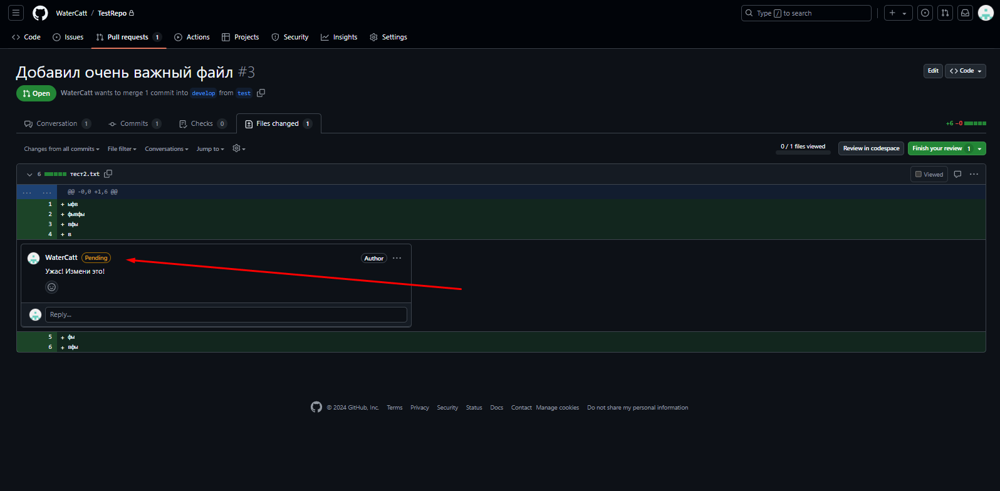

### Как исправить PR?

Если вы добавите новые коммиты в ту же самую ветку, то активный PR автоматически подтянет их. Поэтому, если в вашем коде потребовались изменения, то просто возвращайтесь в свою ветку и коммитьте исправления.

Когда вы закончили исправлять все замечания, то нужно запросить у меня повторный обзор кода:

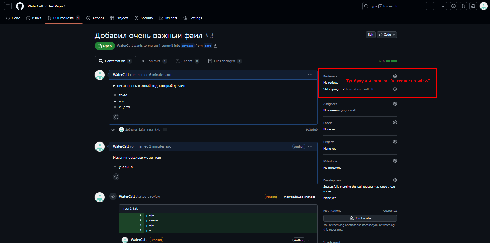

## Issues

Поскольку мы испольузем `Issues` как задачи, то создавать буду их я (тимлид). Ваша задача просто следить за появлением у вас новых задач.

Более того, поскольку я у вас принимаю Pull-request, то закрывать ваши issue буду тоже я. Так что каких-то особых знаний работы с issues вам пока не требуется.
